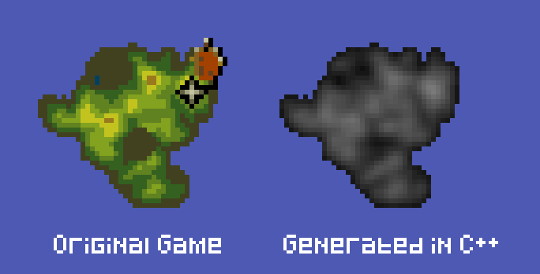
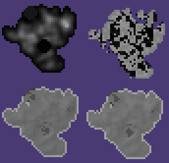

# PowerMonger Terrain Generation 101

[PowerMonger](https://www.mobygames.com/game/1993/powermonger/), by Bullfrog/EA, was a realtime strategy game set in a medieval world. It was ported to many different platforms (Amiga, ST, IBM PC, SNES, SEGA MegaDrive,etc). Whilst all these versions had slight differences, all generated the same terrains from the same seed data. For many years I’d been curious about how this was done (and I’m tremendously grateful to [Anthony Salter / Viridian Games](https://viridiangames.com/2008/06/04/powermonger-map-file-format/) for his assistance with the PC map file format which helped shorten this journey considerably).



We’ll dive straight into the implementation and save the investigation/journey story for another day. Due to being more familiar with 68k than x86 DOS RealMode assembly, I used the Amiga version (my own original floppy disk, imaged with a Greaseweazle). This was loaded on a stock Amiga 500+ 1MB emulated with [WinUAE](https://www.winuae.net/)’s live debugger and also [Ghidra](https://ghidra-sre.org/)’s CodeBrowser looking at the 1MB RAM data exported raw from WinUAE and loaded at address 0x0 in Ghidra’s 68k 32 Big Endian language disassembler.

TODO - Add a small SDL program to load the `MAPDATA.DAT` and draw the maps. *NOTE - Sadly I cannot host this file as it's still under copyright and you will have to obtain it yourself. Nor can I distribute it on request.* However, it's not hard to find out there. 

## Random Number Generation
The basic random number generator loads a seed number (32bit double word) into a register (D0) and then the constant `-0x44bf19d3` into (D1). Convert that to unsigned and in decimal you get `3141592621` (interesting, would that constant look familiar if I put a point somewhere? 😉🥧It’s a little off, but close).

We literally do a 32bit multiplication of seed and constant (keeping the lower portion due to storage limits). The new seed is stored in memory because it will be used as the seed for the next time the function is called. Unless you use a seed of your own beforehand.

Note that the RNG shifts and trims the actual value that gets returned to callers of the routine. The full 32bit version being stored for the next time the function is called. 

```c
#include <stdint.h> // explicit int types

uint32_t gSeed = 12345678; // Default if the seed is 0, overwritten frequently

uint32_t RANDOM(void) {
    gSeed = (gSeed * 3141592621); // Store the full 32bit double word
    return (gSeed >> 8) & 0x7fff; // Return the bottom part and limit to 32767
}
```

## The Level Data
On the Amiga, the data in MAPDATA.PAK is unpacked into memory. On the PC/MS-DOS version, it's just available in MAPDATA.DAT which sits next to the executable. You can look at this in a Hex editor directly. This has already been [documented nicely by Viridian Games](https://viridiangames.com/2008/06/04/powermonger-map-file-format/), but let's look at the essential data for Level 1 taken from this file. 

356 bytes into the PC MAPDATA.DAT, we get the following values

`1E 19 | 07 50 | 00 08 | 00 23 | 00 31 | 00 04 | 28 33 01 10 16 2D 02 03 1D 3E 02 03 ...`

In order, these appear to be 
```
SEED             = 0x1E19
WALK_LENGTH      = 0x0750
TERRAIN_RAISE    = 0x0008 // 8
START_POSITION_X = 0x0023 // 35
START_POSITION_Y = 0x0031 // 49
SMOOTHING_PASSES = 0x0004
```

## The Algorithm (Fractal Brownian Motion)

I had long suspected that PowerMonger was doing a "random walk" across the terrain, lifting the heightfield as it goes and then smoothing over the final result to make it more natural. [This Wikipedia article sums it up perfectly.](https://en.wikipedia.org/wiki/Random_walk)

That article also has a [great little SVG animation](https://upload.wikimedia.org/wikipedia/commons/c/cb/Random_walk_25000.svg) I suggest you view to understand this visually. 

To keep things simple, we will assume the map is kept in a 2D BYTE array of dimensions 64 x 128

```
#define MAPW 64
#define MAPH 128

uint8_t map[MAPW * MAPH];
```
### Terrain Generation Phase
1. Start at your start position
2. Move to a neighbouring tile
3. Add TERRAIN_RAISE to that element's existing value *
4. Repeat until WALK_LENGTH iterations have been completed

TODO \* - This pass also looks at a special tile map in memory which contains information about the actual objects in the scene. Villages, roads, etc., so there's more to do here to get the exact results in PowerMonger. It only raises the terrain if the least significant bit is 0.

### Sea level phase
1. Go through the whole map and if a value is < 0, make sure it is 0. 

NOTE - I'm not sure why this pass is necessary, as height should never be negative, but there may be more here to uncover.

### Smoothing phase
1. For each element in the array, look at the element LEFT, RIGHT, ABOVE and BELOW. 
2. Sum these up and divide by 4.
3. Add this value to the CURRENT element.
4. Divide by 2 and set this as the new value.

NOTE - You could sum these up and integer divide by 5 but this was the more efficient way on assembler to do it as sums and power-of-2 divisions.

Once again, let's look at this in C

```c
void SMOOTHING_PASS(void)
{
    int x, y;

    for (x = 1; x < MAPW - 1; ++x)
        for (y = 1; y < MAPH - 1; ++y)
        {
            int index = y * MAPW + x;

            // TODO - PowerMonger is checking another array here, and it seems to be
            // only smoothing if the value is 0, which may explain the sharp edges around
            // settlements and other objects in the terrain
            map[index] = ((((map[index - MAPW] + 
                             map[index - 1]) + 
                             map[index + 1] + 
                             map[index + MAPW]) / 4) + // >> 2 in ASM
                             map[index]) / 2; // >> 1 in ASM
        }
}

void BROWNIAN_WALK(void)
{
    int16_t walkLength = WALK_LENGTH;
    uint8_t heightOffset = TERRAIN_PUSH_VALUE;
    uint16_t xPos = START_POSITION_X;
    uint16_t yPos = START_POSITION_Y;
    uint16_t index = 0;

    gSeed = (uint32_t)_LEVEL_SEED; // Set the level seed

    do
    {
        xPos += (RANDOM() % 3) - 1; // -1, 0, 1 on the x axis
        yPos += (RANDOM() % 3) - 1; // -1, 0, 1 on the y axis

        xPos &= 0x3f; // Limit to 64 map width
        yPos &= 0x7f; // Limit to 128 map height

        index = yPos * MAPW + xPos; // Calculate the index in the map array

        map[index] += heightOffset; // Add the height offset to the map

        // TODO - Actually, PowerMonger is checking another array here, and it seems to be
        // only adding height if the tile does not contain a settlement or other object
        // if (detailsMap[index] & 2 == 0) 
        //    map[index] += heightOffset; // Add the height offset to the map

        --walkLength;
    } while (walkLength != -1);

    for (index = 0; index < SMOOTHING_PASSES; ++index)
        SMOOTHING_PASS();
}
```

## Further Investigations
If we look into the memory further, we see PowerMonger is storing 4 versions of the map in byte arrays. 



1. Heightfield (top left)
2. The map details (top right)
3. The texture index of Triangle 1 (in a tile) (bottom left in the pic)
4. The texture index of Triangle 2 (in a tile) (bottom right in the pic)

The map details are definitely being used in the generation phase, but I haven't uncovered (yet) whether they are part of the original MAPDATA.DAT

Also, we haven't looked at how roads and waterfalls affect the terrain yet.
